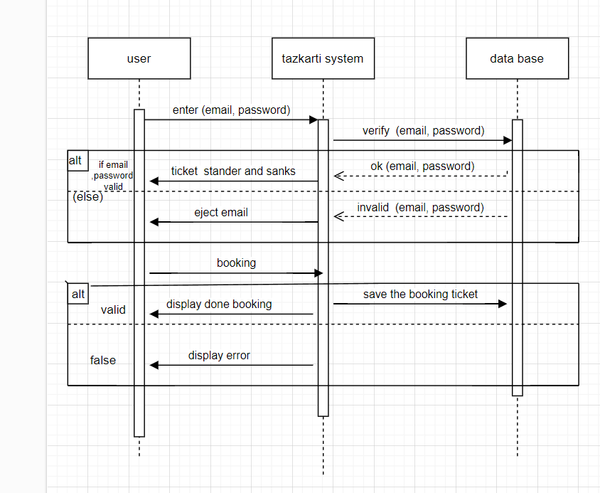

# 🎟️ Tazkarti Concert Ticket Booking System  

## 👨‍💻 **Developed by**  
- **Yousef Ali** (20101108)  
- **Ahmed Saad** (20108269)  

---

## 📖 **Table of Contents**  
- [Introduction](#introduction)  
- [Requirements](#requirements)  
  - [Functional Requirements](#functional-requirements)  
  - [Nonfunctional Requirements](#nonfunctional-requirements)  
- [Diagrams](#diagrams)  
  - [Use Case Diagram](#use-case-diagram)  
  - [Class Diagram](#class-diagram)  
  - [Sequence Diagram](#sequence-diagram)  
- [Process Model](#process-model)  

---

## 📚 **Introduction**  

In today's entertainment landscape, the demand for seamless and convenient access to concert events has never been higher. This project aims to address this demand by developing a rich **concert ticket booking site**, named **Tazkarti**.  

The platform will allow users to:  
- Explore a diverse range of parties and concerts  
- Choose showtimes  
- Select preferred seats  
- Book tickets conveniently  

Administrators will have tools to manage parties, categorize them by genre, release date, and language, and receive notifications for bookings and cancellations.  

The project emphasizes intuitive design, scalability, responsive interfaces, and secure bookings to enrich the concert-going experience for all stakeholders.  

---

## ✅ **Requirements**  

### **Functional Requirements**  

**Users:**  
1. Users can browse available parties and showtimes.  
2. Users can create accounts and log in.  
3. Users can pre-order snacks and concessions while booking tickets.  
4. Users receive confirmation emails and SMS for their bookings.  

**Admins:**  
1. Admins can add new parties to the system.  
2. Parties are categorized by genre, release date, and language.  
3. Admins receive notifications for new bookings and cancellations.  

### **Nonfunctional Requirements**  
1. The system should be responsive and usable on desktops, tablets, and smartphones.  
2. It should handle an increasing number of users and bookings as the system scales.  
3. Code submissions, reviews, and project information should be stored securely.  

---

## 📊 **Diagrams**  

### **Use Case Diagram**  
The **Use Case Diagram** illustrates how users and admins interact with the system and shows key functionalities, including browsing, booking, and managing events.  

  

### **Class Diagram**  
The **Class Diagram** defines the key classes of the system, their attributes, and relationships.  

  

**Key Points:**  
- Tazkarti consists of multiple branches, each led by a branch manager.  
- Users have attributes such as SSN, name, phone number, and email.  
- Bookings are associated with users and contain booking IDs, dates, and confirmation messages.  
- Parties have a name, ID, and language attributes.  

### **Sequence Diagram**  
The **Sequence Diagram** demonstrates the interaction between the user, Tazkarti system, and the database during key processes such as logging in and booking tickets.  

  

---

## 🛠️ **Process Model**  

We adopted the **reuse model** since this project builds upon an existing ticket booking system by adding new features and improving the user experience.  

---

## 🚀 **Key Features**  
- **Browse Available Parties:** Users can explore available concerts and view showtimes.  
- **Account Creation:** Users can sign up, log in, and manage their profiles.  
- **Pre-order Snacks:** Users can order concessions while booking tickets.  
- **Admin Tools:** Admins can manage events and receive booking notifications.  
- **Confirmation Messages:** Users receive booking confirmations via email and SMS.  

---

## 🏗️ **Class Relationships Summary**  

- **Branches:** Each branch has a code, address, and phone number.  
- **Users:** Identified by a unique SSN, users can book tickets for multiple events.  
- **Admins:** Manage parties and receive notifications.  
- **Parties:** Can be booked by multiple users and categorized by genre, language, and release date.  
- **Booking:** Stores information about the user, booking ID, and related confirmations.  

---

## 📦 **Future Improvements**  
- Implement a mobile application version of the system for iOS and Android.  
- Add advanced analytics to help admins track the most popular events and user preferences.  
- Integrate secure payment gateways for online ticket payments.  

---

## 📜 **License**  
This project is licensed under the **MIT License**. Feel free to use and enhance it as needed.  

---

